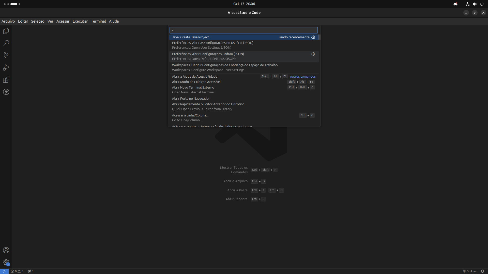
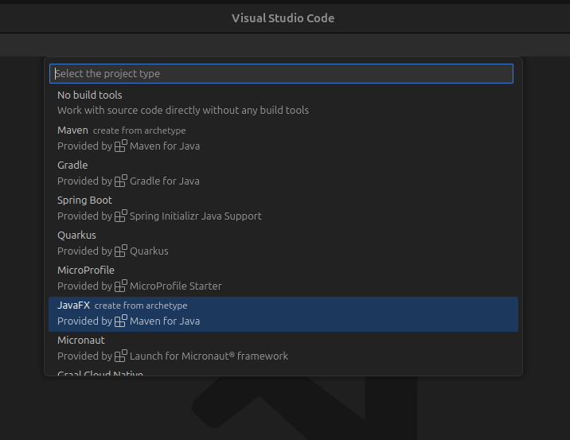

<h1 align="center">
  
Desafio .NET - balta.io

  
</h1>

# Introdução

Esse projeto foi criado para documentar meu aprendizado com JavaFX.

### [Documentação](https://openjfx.io/openjfx-docs/)

### [Demonstrações](https://openjfx.io/)

### [Oracle](https://docs.oracle.com/javase/8/javase-clienttechnologies.htm)

### [JetBrains](https://www.jetbrains.com/help/idea/javafx.html)

# Desenvolvimento Local

### Requisitos

- Java 21

### Instalação

Baixe um JDK apropriado para seu sistema operacional. O JDK mais recente pode ser baixado do site oficial Site [OpenJDK](https://jdk.java.net/21).

Depois de instalado, você pode usar o `java` comando da sua linha de comando.

Verifique se a versão correta do Java está instalada. O seguinte mostra a saída para OpenJDK 21:

    java -version

A saída deve ser algo parecido com:

    openjdk version "21" 2023-09-19
    OpenJDK Runtime Environment (build 21+35-2513)
    OpenJDK 64-Bit Server VM (build 21+35-2513, mixed mode, sharing)

### Visual Studio Code

Baixe um JDK apropriado para o seu sistema operacional e defina `JAVA_HOME` para o diretório JDK.

#### Crie um projeto Java

Digite `CTRL + SHIFT + P` para visualizar todos os comandos JAVA, escolha `Java: Create Java project...` e selecione-o.

 
 

Agora é só escolher o JavaFX e definir o nome do grupo e o artifact id.

 
 

# Tecnologias utilizadas

- Java FX: 17.0.1
- Código do Visual Studio: 1.63.2
- Pacote de extensão para Java: 0.21.0
- Gradle para Java: 3.10.0

# Estatísticas

- Github issues: 
- Github forks: 
- Github stars: 

# Desenvolvedores

| [ Rômulo de Oliveira](https://github.com/romulodeoliveira) |
| :-------------------------------------------------------------------------------------------------------------------------------------------------: |
